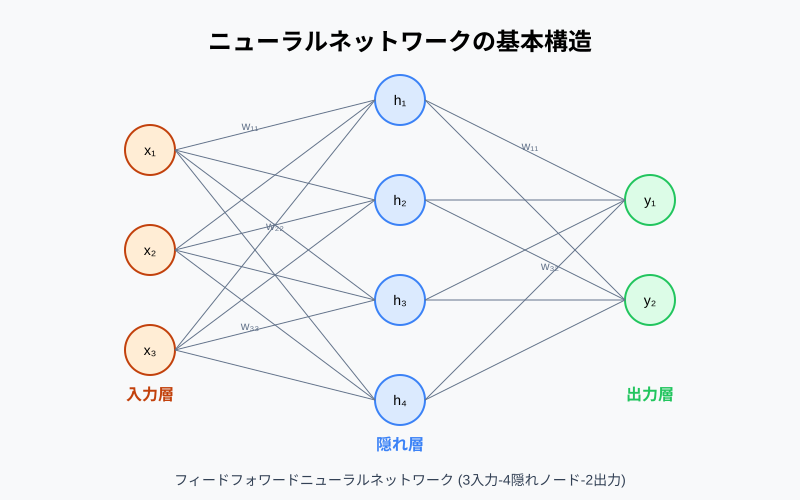

# 第2章：ニューラルネットワークの基礎 - 計算の仕組みを理解する

前章で「深層学習とは多層ニューラルネットワークを使う機械学習である」と整理しました。本章では、そのニューラルネットワークが**具体的にどんな計算をしているのか**を追いかけます。

先に結論を言ってしまうと、ニューラルネットワークの正体は**行列の掛け算と足し算、そして非線形関数の繰り返し**です。それだけです。本章のゴールは、この一文を「なるほど確かにそうだ」と納得できる状態になることです。

なお本章では「どう計算するか（順伝播）」だけを扱います。「どう学習するか」は第3章の担当です。

## 2.1 ニューロンとパーセプトロン

### 生物のニューロンからの発想

ニューラルネットワークの発想の出発点は、脳の神経細胞（ニューロン）です。

生物のニューロンは、複数の樹状突起から電気信号を受け取り、その合計がある閾値を超えると発火して、軸索を通じて次のニューロンへ信号を送ります。


これを数学的に単純化したものが**人工ニューロン**です。

```
  入力 x1 ──(重み w1)──┐
                      │
  入力 x2 ──(重み w2)──┼──→ [ 合計 + バイアス ] ──→ [ 活性化関数 ] ──→ 出力 y
                      │
  入力 x3 ──(重み w3)──┘
```

> **よくある誤解**
> 「ニューラルネットワークは脳を模倣している」という説明は、**発想の由来としては正しいが、実態としてはかなり違います**。現代の深層学習は生物学的妥当性をほとんど気にしていません。「脳にヒントを得た数学モデル」くらいに捉えるのが実務的です。

### 重み・バイアス・入力の内積

人工ニューロンが行う計算は、次の2ステップだけです。

**ステップ1：重み付き和を計算する**

```
z = w1*x1 + w2*x2 + w3*x3 + b
```

- `x` : 入力（データ）
- `w` : **重み（weight）** — その入力をどれだけ重視するか。学習で更新される
- `b` : **バイアス（bias）** — 発火のしやすさを調整するゲタ。これも学習で更新される

`w1*x1 + w2*x2 + w3*x3` の部分は、ベクトルの**内積**そのものです。

**ステップ2：活性化関数を通す**

```
y = f(z)
```

`f` が**活性化関数**です。詳しくは 2.3 で扱います。

NumPy で書くと、驚くほど短いコードになります。

```python
import numpy as np

x = np.array([1.0, 2.0, 3.0])       # 入力
w = np.array([0.5, -0.2, 0.1])      # 重み（学習で決まる値）
b = 0.3                              # バイアス

z = np.dot(w, x) + b                 # 重み付き和
print(z)                             # 0.5*1 + (-0.2)*2 + 0.1*3 + 0.3 = 0.7

y = max(0.0, z)                      # 活性化関数（ReLU）
print(y)                             # 0.7
```

**重みとバイアスが「学習されるパラメータ」**です。深層学習における「学習」とは、突き詰めればこの `w` と `b` の値を良い方向へ調整し続けることに他なりません。

### 単層パーセプトロンの限界（XOR問題）

1958年に考案された**パーセプトロン**は、この人工ニューロン1個で分類を行うモデルです。重み付き和が0以上なら1、そうでなければ0を出力します。

これで AND や OR は表現できます。

```python
import numpy as np

def perceptron(x, w, b):
    return 1 if np.dot(w, x) + b > 0 else 0

# AND ゲート
w_and, b_and = np.array([0.5, 0.5]), -0.7
for x in [(0,0), (0,1), (1,0), (1,1)]:
    print(x, perceptron(np.array(x), w_and, b_and))
# (0,0) 0 / (0,1) 0 / (1,0) 0 / (1,1) 1
```

ところが、**XOR（排他的論理和）は単層パーセプトロンでは絶対に表現できません**。

| x1 | x2 | AND | OR | XOR |
|----|----|-----|-----|-----|
| 0 | 0 | 0 | 0 | 0 |
| 0 | 1 | 0 | 1 | **1** |
| 1 | 0 | 0 | 1 | **1** |
| 1 | 1 | 1 | 1 | **0** |

理由は幾何的に考えると明快です。単層パーセプトロンができるのは、**平面上に直線を1本引いて2つに分ける**ことだけです。

```
  【AND：直線1本で分けられる】      【XOR：直線1本では無理】
   x2                              x2
   1 │  ○      ○                   1 │  ●      ○
     │        ／                     │
   0 │  ○   ／ ●                   0 │  ○      ●
     └───────────  x1               └───────────  x1
        0      1                       0      1
     ○=0出力  ●=1出力              どう直線を引いても分離不能
```

これを**線形分離可能性**の問題と呼びます。1969年にこの限界が指摘されたことで、ニューラルネットワーク研究は最初の冬の時代に入りました。

そして解決策が、次節のテーマです。**層を重ねればよい**のです。

## 2.2 多層ニューラルネットワーク

### 入力層・隠れ層・出力層

ニューロンを層状に並べ、複数段つなげたものが**多層ニューラルネットワーク**です。



```
  入力層          隠れ層          出力層
  (input)        (hidden)        (output)

   ○ ──────────→ ○ ──────────→ ○
     ＼    ／  ＼   ＼    ／
   ○ ──╳─────→ ○ ──╳─────→ ○
     ／    ＼  ／   ／    ＼
   ○ ──────────→ ○ ──────────→ ○

  特徴量3つ      ニューロン3つ    クラス2つ
```

| 層 | 役割 |
|----|------|
| **入力層** | データをそのまま受け取る。計算はしない。ノード数＝特徴量の数 |
| **隠れ層（hidden layer）** | 特徴を段階的に変換していく。外から見えないので「隠れ」 |
| **出力層** | 最終的な予測を出す。ノード数＝分類したいクラス数（回帰なら1） |

この**隠れ層が2層以上あるものを「深い（deep）」ネットワーク**と呼び、それを使う学習が「深層学習」です。「深層」の語源はここにあります。

すべてのノードが次の層の全ノードとつながっている構造を**全結合層（fully connected layer / Dense層）**と言います。PyTorch では `nn.Linear` がこれに当たります。

XOR は、隠れ層を1つ挟むだけで解けるようになります。隠れ層のニューロンが「NAND」と「OR」に相当する中間表現を作り、出力層がそれを AND で合成するイメージです。

### 順伝播（forward propagation）の計算

入力から出力へ向かって、層ごとに計算を進めていく処理を**順伝播（forward propagation）**と呼びます。やることは各層で同じで、

1. 重み付き和を計算する
2. 活性化関数を通す
3. その結果を次の層の入力にする

これを層の数だけ繰り返すだけです。

### 行列演算としての表現

ニューロン1個ずつをループで回すと遅いので、実際には**行列演算としてまとめて計算**します。ここが GPU が効く理由でもあります。

層の計算は、たった1行の式で書けます。

```
a = f(W · x + b)
```

| 記号 | 形状 | 意味 |
|------|------|------|
| `x` | (入力数,) | その層への入力ベクトル |
| `W` | (出力数, 入力数) | 重み行列 |
| `b` | (出力数,) | バイアスベクトル |
| `f` | — | 活性化関数（要素ごとに適用） |

では、NumPy で順伝播を手計算してみましょう。入力2次元 → 隠れ層3ニューロン → 出力1、という小さなネットワークです。

```python
import numpy as np

def relu(z):
    return np.maximum(0, z)

def sigmoid(z):
    return 1 / (1 + np.exp(-z))

# --- 入力（XORの入力 [1, 0] を想定）---
x = np.array([1.0, 0.0])

# --- 第1層：入力2 → 隠れ層3 ---
W1 = np.array([[ 0.5, -0.3],
               [ 0.8,  0.2],
               [-0.4,  0.9]])      # shape: (3, 2)
b1 = np.array([0.1, -0.2, 0.0])    # shape: (3,)

z1 = W1 @ x + b1                   # 重み付き和
a1 = relu(z1)                      # 活性化
print("z1 =", z1)                  # [ 0.6  0.6 -0.4]
print("a1 =", a1)                  # [ 0.6  0.6  0. ]   ← 負の値は0に

# --- 第2層：隠れ層3 → 出力1 ---
W2 = np.array([[1.0, -1.5, 0.7]])  # shape: (1, 3)
b2 = np.array([0.2])

z2 = W2 @ a1 + b2
y  = sigmoid(z2)                   # 出力層はSigmoid（2値分類）
print("z2 =", z2)                  # [-0.1]
print("y  =", y)                   # [0.475]  → 「クラス1である確率 47.5%」
```

ここで手を動かして確認してほしいポイントが3つあります。

1. `W1 @ x + b1` の1行で、隠れ層の3ニューロン分の計算が**同時に**終わっている
2. ReLU によって `z1` の負の成分 `-0.4` が `0.0` に潰れている
3. 最終出力が 0〜1 に収まっており、確率として解釈できる

#### 複数データをまとめて処理する（バッチ処理）

実務では1件ずつではなく、複数サンプルをまとめて流します。入力を行列にするだけで対応できます。

```python
# 4サンプルをまとめて処理（XORの全パターン）
X = np.array([[0.0, 0.0],
              [0.0, 1.0],
              [1.0, 0.0],
              [1.0, 1.0]])         # shape: (4, 2)  ← (バッチサイズ, 特徴量数)

A1 = relu(X @ W1.T + b1)           # shape: (4, 3)
Y  = sigmoid(A1 @ W2.T + b2)       # shape: (4, 1)
print(Y.ravel())                   # 4サンプル分の予測が一度に出る
```

`for` ループが1つもないことに注目してください。この形なら GPU が数千コアで並列に処理できます。**深層学習の計算が速いのは、問題を行列積に落とし込んでいるから**です。

#### PyTorch で書くとどうなるか

同じことを PyTorch で書くと、重みの確保が自動化されます。

```python
import torch
import torch.nn as nn

model = nn.Sequential(
    nn.Linear(2, 3),   # 入力2 → 隠れ層3（WとbはPyTorchが自動で用意）
    nn.ReLU(),
    nn.Linear(3, 1),   # 隠れ層3 → 出力1
    nn.Sigmoid(),
)

X = torch.tensor([[0., 0.], [0., 1.], [1., 0.], [1., 1.]])
print(model(X))        # 順伝播（forward）が実行される

# パラメータ数を数えてみる
n = sum(p.numel() for p in model.parameters())
print("パラメータ数:", n)   # (2*3+3) + (3*1+1) = 13
```

パラメータ数の計算式は覚えておくと便利です。

```
1層あたりのパラメータ数 = (入力数 × 出力数) + 出力数
                          └─ 重み ─┘     └バイアス┘
```

ちなみに GPT-3 のパラメータ数は 1750億個です。桁は違いますが、やっていることは**この 13 個の計算の延長線上**にあります。

## 2.3 活性化関数

### なぜ非線形性が必要なのか

「活性化関数を挟む」というステップが、なぜ必要なのでしょうか。取り除いてみると分かります。

活性化関数がない場合、2層のネットワークは次のようになります。

```
  第1層： a = W1·x + b1
  第2層： y = W2·a + b2
        = W2·(W1·x + b1) + b2
        = (W2·W1)·x + (W2·b1 + b2)
        = W'·x + b'          ← 結局1層と同じ形！
```

**線形変換を何回重ねても、線形変換のまま**です。つまり活性化関数がなければ、何百層積もうと単層パーセプトロンと同じ表現力しかなく、XOR すら解けません。

活性化関数という**非線形な処理**を各層に挟むことで初めて、層を重ねることに意味が生まれます。

> **ここが第2章の核心です**
> 「行列積（線形）と活性化関数（非線形）を交互に重ねる」——これが深層学習の基本構造です。CNN も Transformer も、この骨格の上に立っています。

### Sigmoid / tanh / ReLU とその派生


代表的な活性化関数を整理します。

| 関数 | 式 | 出力範囲 | 主な用途・特徴 |
|------|-----|---------|--------------|
| **Sigmoid** | 1 / (1 + e^-z) | 0 〜 1 | 2値分類の出力層。隠れ層では勾配消失を起こすため今はほぼ使わない |
| **tanh** | (e^z - e^-z)/(e^z + e^-z) | -1 〜 1 | 出力が0中心で Sigmoid より学習しやすい。RNN で使われる |
| **ReLU** | max(0, z) | 0 〜 ∞ | **隠れ層のデファクト標準**。計算が軽く勾配消失しにくい |
| **Leaky ReLU** | max(0.01z, z) | -∞ 〜 ∞ | ReLU の「死んだニューロン」対策 |
| **GELU** | 確率的に滑らかな ReLU | ≒ -0.17 〜 ∞ | Transformer 系で標準的に使われる |

```python
import numpy as np

def sigmoid(z):     return 1 / (1 + np.exp(-z))
def tanh(z):        return np.tanh(z)
def relu(z):        return np.maximum(0, z)
def leaky_relu(z):  return np.where(z > 0, z, 0.01 * z)

z = np.array([-2.0, -0.5, 0.0, 0.5, 2.0])
print("sigmoid   :", np.round(sigmoid(z), 3))     # [0.119 0.378 0.5   0.622 0.881]
print("tanh      :", np.round(tanh(z), 3))        # [-0.964 -0.462 0. 0.462 0.964]
print("relu      :", relu(z))                     # [0.  0.  0.  0.5 2. ]
print("leaky_relu:", leaky_relu(z))               # [-0.02 -0.005 0. 0.5 2. ]
```

**なぜ ReLU が主流なのか**

1. **計算が極めて軽い** — `max(0, z)` の比較1回。指数関数が不要
2. **勾配消失が起きにくい** — 正の領域では傾きが常に1。Sigmoid は入力が大きいと傾きがほぼ0になり、深い層で学習が進まなくなる
3. **スパース性** — 出力の約半分が0になり、表現が整理される

ReLU の弱点は、入力が常に負になったニューロンが二度と復活しない **「死んだ ReLU（dying ReLU）」** 問題です。これを緩和するのが Leaky ReLU です。

> **迷ったときの指針**
> 隠れ層は **ReLU**（Transformer 系を組むなら GELU）。これで実務の大半は足ります。

### 出力層の活性化関数（Softmax）とタスクの対応

隠れ層は ReLU で構いませんが、**出力層はタスクによって使い分けが決まっています**。ここは丸暗記する価値がある対応表です。

| タスク | 出力層の活性化関数 | 出力ノード数 | 出力の意味 |
|--------|------------------|------------|-----------|
| 回帰 | **なし（恒等関数）** | 1 | 予測値そのまま |
| 2値分類 | **Sigmoid** | 1 | クラス1である確率 |
| 多クラス分類 | **Softmax** | クラス数 | 各クラスの確率（合計1） |
| マルチラベル分類 | **Sigmoid** | ラベル数 | 各ラベルが独立に成立する確率 |

**Softmax** は、任意の実数ベクトルを「合計が1になる確率分布」に変換する関数です。

```
softmax(z_i) = exp(z_i) / Σ exp(z_j)
```

```python
import numpy as np

def softmax(z):
    z = z - np.max(z)              # オーバーフロー対策（結果は変わらない）
    exp_z = np.exp(z)
    return exp_z / np.sum(exp_z)

# 3クラス分類の出力層。生のスコア（logits）
logits = np.array([2.0, 1.0, 0.1])
probs = softmax(logits)
print(np.round(probs, 3))          # [0.659 0.242 0.099]
print(probs.sum())                 # 1.0
print("予測クラス:", np.argmax(probs))  # 0
```

活性化関数を通す前の生のスコアを **ロジット（logits）** と呼びます。LLM の文脈でもよく出てくる用語なので、ここで覚えておいてください。

> **実装上の注意**
> PyTorch で多クラス分類を書くとき、損失関数 `nn.CrossEntropyLoss` は**内部で Softmax を適用します**。モデル側の出力層にも Softmax を書くと二重適用になり、学習がうまく進みません。「モデルはロジットを返し、損失関数が Softmax する」が PyTorch の作法です（第3章で再登場します）。

## まとめ

本章では、ニューラルネットワークが行う計算の中身を追いかけました。

✅ **人工ニューロンは「入力と重みの内積 ＋ バイアス」を計算し、活性化関数に通すだけ**
✅ **単層では XOR すら解けない（線形分離の限界）。だから層を重ねる**
✅ **順伝播の1層は `a = f(W·x + b)` という行列演算。GPU で並列化できるのはこの形のおかげ**
✅ **活性化関数の非線形性がなければ、何層積んでも1層と等価になる**
✅ **隠れ層は ReLU が標準。出力層はタスクに応じて恒等関数 / Sigmoid / Softmax を使い分ける**

ただし本章では、重み `W` とバイアス `b` の値は「すでに与えられたもの」として扱ってきました。次章では、この値を**データから自動的に決めていく仕組み**——損失関数・勾配降下法・誤差逆伝播法——を扱います。深層学習の心臓部です。

## 演習問題

1. 入力4次元 → 隠れ層8 → 隠れ層8 → 出力3 という全結合ネットワークがあります。学習対象となるパラメータ（重み＋バイアス）は全部で何個ですか。層ごとに計算して合計してください。

2. 次のコードを実行し、活性化関数を ReLU から「恒等関数（何もしない）」に変えると出力がどう変わるか予想し、実際に確かめてください。そして 2.3 の議論と結びつけて、何が起きているか説明してください。

```python
import numpy as np
X  = np.array([[0.,0.], [0.,1.], [1.,0.], [1.,1.]])
W1 = np.array([[1., 1.], [1., 1.]]); b1 = np.array([0., -1.])
W2 = np.array([[1., -2.]]);          b2 = np.array([0.])
A1 = np.maximum(0, X @ W1.T + b1)    # ← ここを X @ W1.T + b1 に変えてみる
print(A1 @ W2.T + b2)
```

3. 次の3つのタスクについて、出力層のノード数と活性化関数を答えてください。
   - (a) 気温から明日の電力需要量（kWh）を予測する
   - (b) メールをスパム / 非スパムに分類する
   - (c) ニュース記事を「政治・経済・スポーツ・芸能」の4カテゴリに分類する

4. （発展）Sigmoid のグラフを見ると、入力が 10 や -10 のあたりでほぼ平らになっています。この「平らである」ことが、深いネットワークの学習にとってなぜ不都合なのか、考えてみてください（詳しくは第3章・第6章で扱います）。
